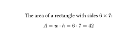

# eqrun

An *eq*uation *run*ner.
You pass an equation through the library, it reads all the variables mentioned in it,
inserts their values, returns the equation with its result and saves that result as a variable.

## Usage

First, create the runner providing the inital variables:

```typst
#import "./lib.typ": eqrun-builder

#let init = (
  w: 6,
  h: 7,
)
#let eqrun = eqrun-builder(init)

The area of a rectangle with sides $#init.w times #init.h$:
```

Write the equation and pass it to the runner:

```typst
#eqrun($A = w dot h$)
```


Now you can use the new variable in other equations:

```typst
Half of that is:
#eqrun($A_"triangle" = A / 2$)
```


And get all the variables out of the runner:
```typst
#context [
  #let state = eqrun()
  A: #state.A\
  A triangle: #state.A-triangle
]
```

